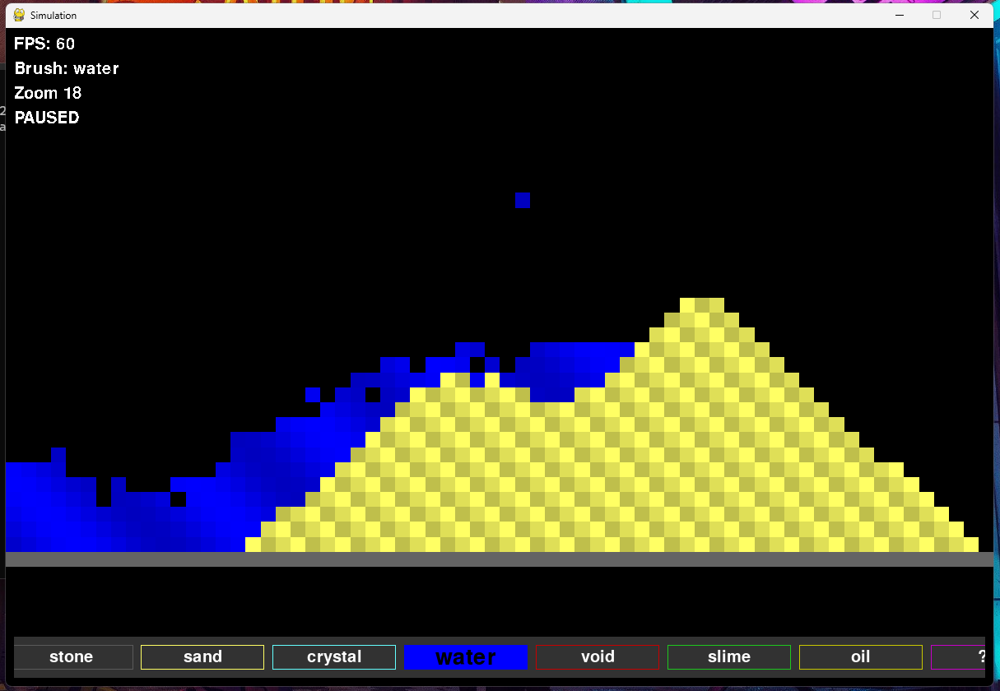

# ParticleEngine
A simple python falling sand simulation game

# Controls
- Use right mouse button to place
- Use left mouse button to destroy
- Use WASD to move viewport
- Use - and = to zoom in and out (I reccomend that you don't zoom out to much since it lags a lot)
- Use the arrow keys to select an element

# Requirements
- Pygame
- Numpy
